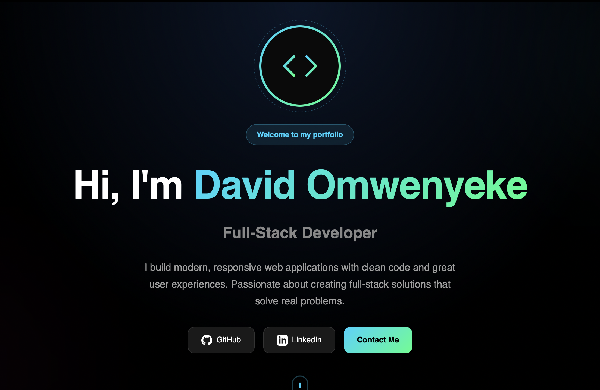
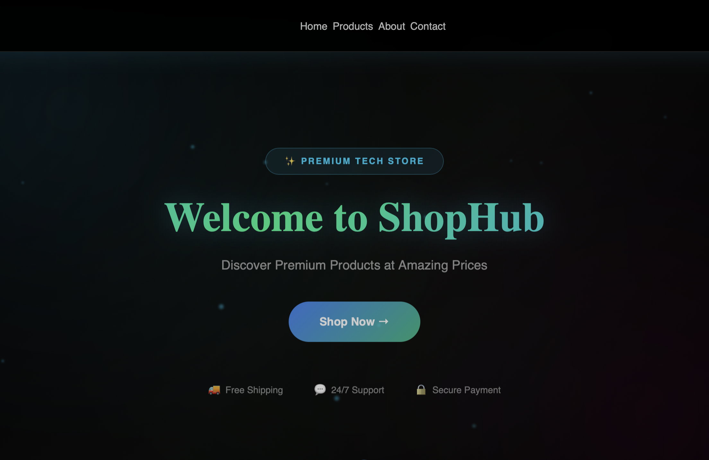
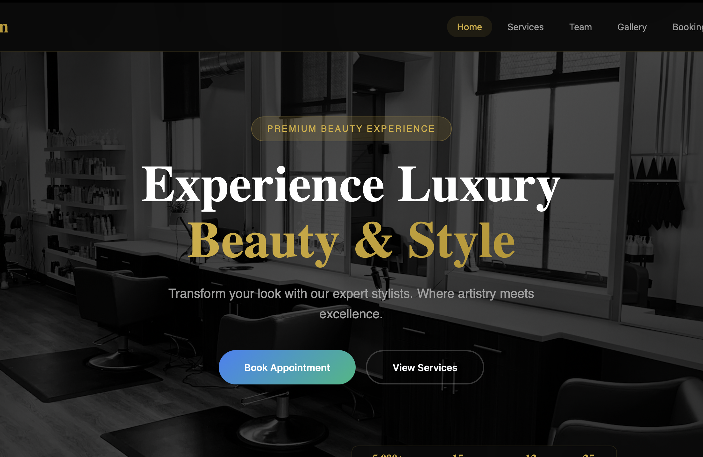
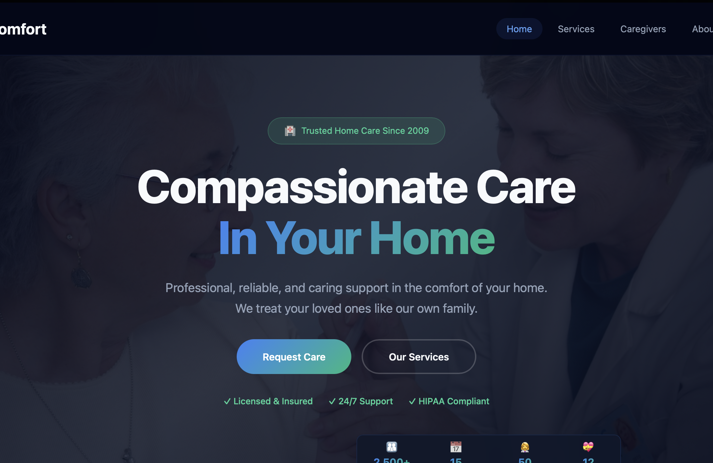

# David Omwenyeke - Portfolio

A personal portfolio showcasing **three full-stack web applications** built with React, Node.js, and SQLite.

[](https://react.dev)
[](https://nodejs.org)
[](https://sqlite.org)

---

## 🔗 Live Demo

**[View Live Demo](https://david-omwenyeke-portfolio.vercel.app)**

---

## 📸 Screenshots

### Home Page


### ShopHub E-Commerce


### Elite Salon


### CareComfort HomeCare


---

## 📁 What's Inside

```
Portfolio/
│
├── packages/
│   │
│   ├── frontend/                # React Application (Vite)
│   │   ├── src/
│   │   │   ├── pages/
│   │   │   │   ├── HomePage.jsx       # Personal portfolio landing page
│   │   │   │   ├── ShopHubPage.jsx    # E-commerce store
│   │   │   │   ├── SalonPage.jsx      # Salon booking site
│   │   │   │   └── HomeCarePage.jsx   # Healthcare agency site
│   │   │   │
│   │   │   ├── components/            # Reusable UI components
│   │   │   ├── mockData.js            # Demo data (no backend needed)
│   │   │   ├── api.js                 # API client for backend
│   │   │   └── styles.css             # Global styles
│   │   │
│   │   └── package.json
│   │
│   └── backend/                 # Express.js API Server
│       ├── src/
│       │   ├── server.js              # Express app entry point
│       │   ├── routes/                # API endpoints
│       │   ├── models/                # Database queries
│       │   └── db/
│       │       ├── schema.sql         # Database tables
│       │       └── init.js            # Seed data
│       │
│       └── package.json
│
├── screenshots/                 # README images
├── pnpm-workspace.yaml          # Monorepo config
└── package.json                 # Root scripts
```

---

## 🚀 The Projects

| Project | Route | Description |
|---------|-------|-------------|
| **Portfolio Home** | `/` | Personal intro, skills, social links |
| **ShopHub** | `/shop` | E-commerce with cart, checkout, product catalog |
| **Elite Salon** | `/salon` | Booking system, team profiles, gallery, reviews |
| **CareComfort** | `/homecare` | Caregiver profiles, services, consultation form |

### Features in Each App

- Responsive design (mobile-friendly)
- Smooth animations (Framer Motion)
- Loading skeletons
- Form validation
- Demo mode with mock data

---

## 🛠 Installation

### Prerequisites

- **Node.js** 18 or higher
- **pnpm** (install with `npm install -g pnpm`)

### Steps

```bash
# 1. Clone the repository
git clone https://github.com/iam-david1/Portfolio.git

# 2. Navigate to the folder
cd Portfolio

# 3. Install dependencies
pnpm install

# 4. Start the development server
pnpm run dev
```

### That's it! Open your browser:

| Service | URL |
|---------|-----|
| **Frontend** | http://localhost:5173 |
| **Backend API** | http://localhost:4000 |

---

## 📦 Tech Stack

| Layer | Technologies |
|-------|--------------|
| **Frontend** | React 18, Vite, React Router, Framer Motion |
| **Backend** | Node.js, Express.js, SQLite3 |
| **Styling** | CSS3 (no frameworks) |
| **Tools** | pnpm workspaces, Git |

---

## 🎭 Demo Mode vs Full-Stack Mode

The frontend currently runs in **Demo Mode**:

| Mode | How it works |
|------|--------------|
| **Demo Mode** ✓ | Uses `mockData.js` - no backend needed. Forms show demo messages. |
| **Full-Stack Mode** | Connects to Express API + SQLite. Forms actually save to database. |

To switch to full-stack mode, update the page components to use `api.js` instead of `mockData.js`.

---

## 📜 Available Scripts

Run from the root folder:

```bash
pnpm run dev        # Start frontend + backend
pnpm run build      # Build frontend for production
pnpm run migrate    # Initialize/reset database
```

---

## 👤 Contact

**David Omwenyeke** — Full-Stack Developer

- 🐙 GitHub: [@iam-david1](https://github.com/iam-david1)
- 💼 LinkedIn: [david-omwenyeke](https://www.linkedin.com/in/david-omwenyeke-4054b038a/)

---

## 📄 License

MIT License — feel free to use as inspiration for your own portfolio.
